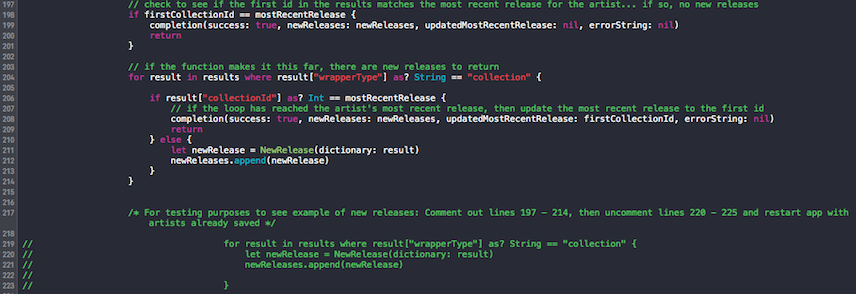

# TuneSentry

## Overview

TuneSentry allows you to search for new releases on the iTunes store using a list of chosen music artists that you track. Using the search icon in the top right-hand corner of the home screen, you access a search page where you can add artists from the iTunes store to add to your tracker list. After each app launch, the app will check for new releases from those tracked artists and display any new releases at the top of the screen. Click the new release to be taken directly to the iTunes page for that new release. You can remove artists from your tracker by pressing the applicable button. For each artist in your tracker, you can also press the applicable button to be taken to the artist's page in iTunes.  

## Instructions

In order to test how new releases display for tracked artists, please comment and uncomment the following lines according to the instructions in the AppleClient.swift file:

## Please Note

Attempts to access the iTunes store through button actions in the collection view cells, for some reason, fail when using the simulator. The correct functionality works, however, when using the app on an actual iPhone device.
